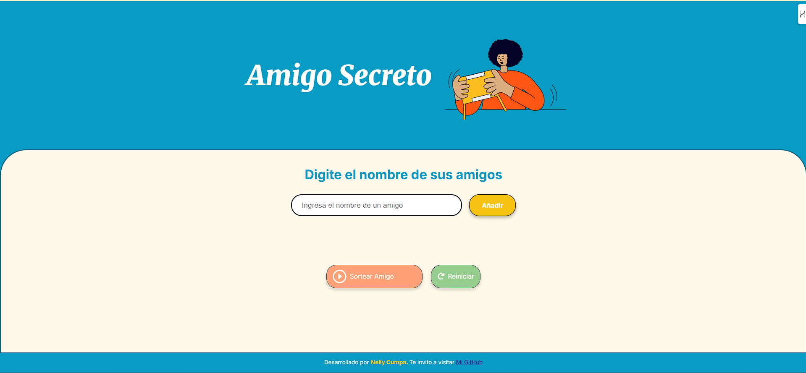
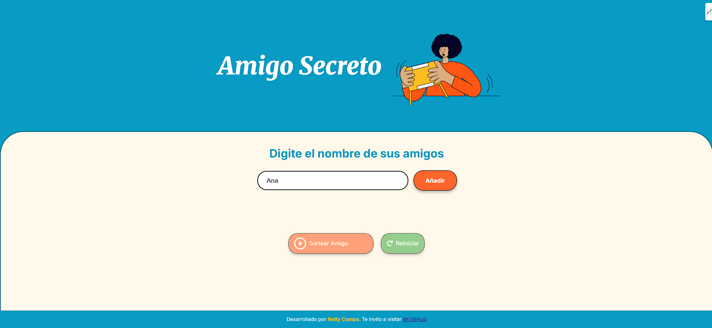
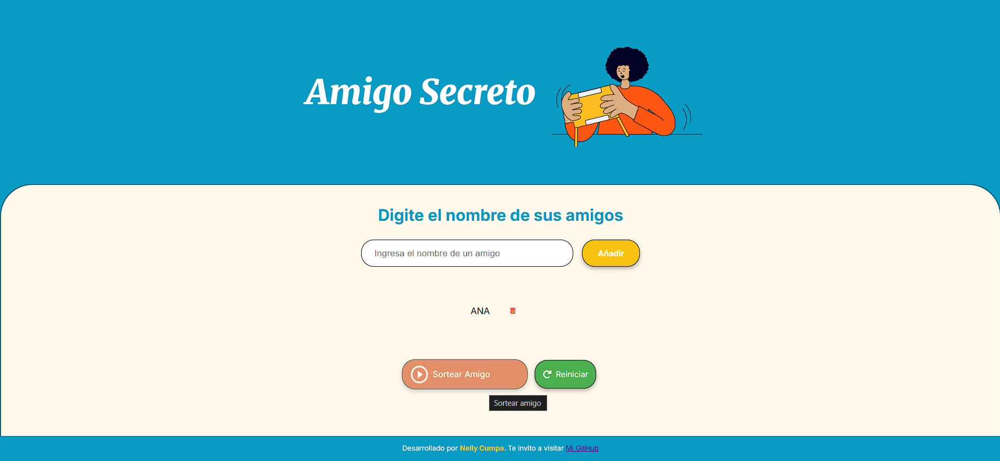
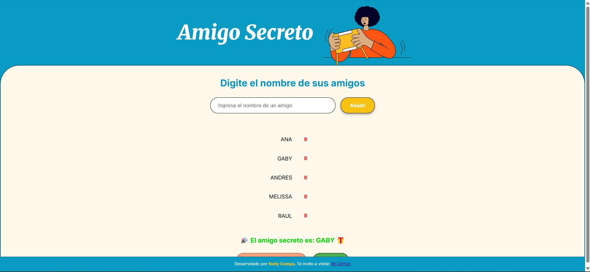
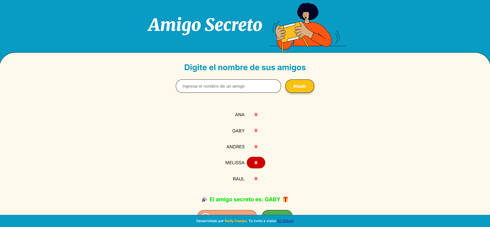
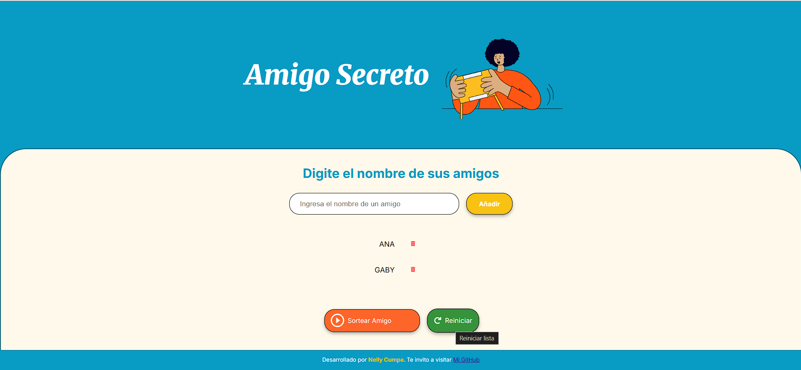

# 🎁 Amigo Secreto App

¡Bienvenido a la aplicación **Amigo Secreto!** 
Esta herramienta te permite organizar un sorteo entre amigos de manera fácil y divertida. Puedes agregar nombres, sortear y reiniciar la lista cuando lo necesites. ¡Y lo mejor de todo es que funciona perfectamente en dispositivos móviles! 📱

---
## **Demo**

Puedes probar la aplicación en línea aquí: [Amigo Secreto App](https://nellycn.github.io/Amigo-Secreto/)

---

## **Tabla de Contenidos**
1. [Introducción](#introducción)
2. [Requisitos](#requisitos)
   - [Requisitos Técnicos](#requisitos-técnicos)
   - [Dispositivos Compatibles](#dispositivos-compatibles)
3. [Tecnologías Utilizadas](#tecnologías-utilizadas)
4. [Instalación](#instalación)
5. [Estructura del Proyecto](#estructura-del-proyecto)
   - [Archivos Principales](#archivos-principales)
   - [Características del Proyecto](#características-del-proyecto)
6. [Cómo Usar](#cómo-usar)
   - [Agregar Amigos](#agregar-amigos)
   - [Sortear Amigo Secreto](#sortear-amigo-secreto)
   - [Reiniciar la Lista](#reiniciar-la-lista)
   - [Eliminar un Nombre](#eliminar-un-nombre)
7. [Habilitar y Deshabilitar Botones](#habilitar-y-deshabilitar-botones)
   - [Botón "Sortear Amigo"](#botón-sortear-amigo)
   - [Botón "Reiniciar"](#botón-reiniciar)
8. [Capturas de Pantalla](#capturas-de-pantalla)
   - [Vista de Escritorio](#vista-de-escritorio)
   - [Vista Móvil](#vista-móvil)
9. [Contribuir](#contribuir)
   - [Cómo Contribuir](#cómo-contribuir)
   - [Guía de Estilo](#guía-de-estilo)
10. [Licencia](#licencia)
11. [Preguntas Frecuentes](#preguntas-frecuentes)
12. [Contacto](#contacto)

---
## **1. Introducción**

La **Amigo Secreto App** es una aplicación web diseñada para ayudarte a organizar sorteos de amigos secretos de manera rápida y sencilla. Con una interfaz intuitiva y funcionalidades fáciles de usar, podrás agregar nombres, realizar sorteos y reiniciar la lista cuando lo necesites. Además, la aplicación es compatible con dispositivos móviles, por lo que puedes usarla en cualquier lugar. 🚀

---
## **2. Requisitos**

### **- Requisitos Técnicos**
Para usar la **Amigo Secreto App**, necesitas:
- Un navegador web moderno (Chrome, Firefox, Edge, Safari, etc.).
- Conexión a Internet (fuentes o íconos externos).

### **- Dispositivos Compatibles**
La aplicación está diseñada para funcionar en:
- *Ordenadores de escritorio y laptops.*
- *Tablets y dispositivos móviles* (diseño responsive).

---
## **3. Tecnologías Utilizadas 🛠️**

La **Amigo Secreto App** fue desarrollada con las siguientes tecnologías:

- **Frontend:**
  - HTML5
  - CSS3 (con variables personalizadas y diseño responsive)
  - JavaScript (ES6+)
- **Fuentes e Íconos:**
  - [FontAwesome](https://fontawesome.com/) (para íconos)
  - [Google Fonts](https://fonts.google.com/) (para fuentes personalizadas)
- **Sonidos:**
  - Efectos de sonido personalizados (aplausos y clics).

---
## **4. Instalación 🚀**

Sigue estos pasos para instalar y ejecutar la **Amigo Secreto App** en tu entorno local:

1. **Clona el repositorio:**
   ```bash
   git clone https://github.com/NellyCN/Amigo-Secreto.git
    ```
2. **Navega al directorio del proyecto:**

    ```bash
    cd Amigo-Secreto
    ```

3. **Abre el archivo `index.html` en tu navegador:**

- Simplemente haz doble clic en el archivo `index.html` o arrástralo a tu navegador.

- También puedes usar un servidor local (por ejemplo, con [Live Server](https://marketplace.visualstudio.com/items?itemName=ritwickdey.LiveServer)) en Visual Studio Code.

**¡Listo!** La aplicación estará lista para usarse en tu navegador.

---
## **5. Estructura del Proyecto 📂**

### **- Archivos Principales**
El proyecto está organizado de la siguiente manera:
```bash
AMIGO-SECRETO/
├── index.html # Archivo principal de la aplicación
├── styles/
│ └── styles.css # Estilos CSS para la aplicación
├── scripts/
│ └── app.js # Lógica de la aplicación en JavaScript
├── sounds/ # Carpeta con sonidos de la aplicación
│ ├── applause.mp3 # Sonido de aplausos
│ └── mouse-click.mp3 # Sonido de clic
├── assets/ # Carpeta para imágenes
└── README.md # Este archivo
```
---
### **- Características del Proyecto ✨**
- **Interfaz intuitiva:** Fácil de usar para cualquier persona.
- **Diseño responsive:** Funciona en dispositivos móviles y de escritorio.
- **Validación de nombres:** Solo permite letras y espacios.
- **Sonidos interactivos:** Añade diversión con sonidos de clic y aplausos.

---
## **6. Cómo usar**

**- Añadir amigos**:
   - Desde un inicio los botones **"Sortear Amigo"** y **"Reiniciar"** estarán deshabilitados.
   - Escribe el nombre de un amigo en el campo de texto.
   - Haz clic en el botón **"Añadir".**
   - El nombre se añadirá a la lista de participantes y se convertirá automáticamente a mayúsculas.
   -**Nota:** Solo se permiten letras y espacios. No se aceptan números ni caracteres especiales.

**- Eliminar amigos**:
   - Cada nombre en la lista tiene un ícono de basura (🗑️)
   - Si deseas eliminar un nombre de la lista, haz clic en el ícono de basura junto al nombre.

**- Sortear Amigo Secreto**:
   - Agrega al menos dos amigos a la lista, el botón **"Sortear Amigo"** se habilitará.
   - Haz clic en el botón **"Sortear Amigo".**
   - ¡La aplicación te mostrará en la pantalla un mensaje como: `🎉 El amigo secreto es: [Nombre] 🎁`.
   - A la vez el botón **Sortear Amigo**, se dehabilitará.
   - **Nota:** Si decides seguir sorteando amigos despues de eliminar de la lista al que ya fue elegido en 1er lugar, también lo puedes hacer, después de eliminar al participante el botón **"Sortear Amigo"**  se habilitará nuevamente.

**- Reiniciar**:
   - Si deseas comenzar de nuevo, haz clic en **"Reiniciar".**
   - Esto limpiará la lista y deshabilitará el botón **"Sortear Amigo"** hasta que agregues nuevos nombres.


---
## **7. Habilitar y Deshabilitar Botones**

### **- Botón "Sortear Amigo"**
- **Se habilita:** Cuando hay al menos dos nombres en la lista.
- **Se deshabilita:** Después de realizar el sorteo o cuando la lista está vacía.

### **- Botón "Reiniciar"**
- **Se habilita:** Cuando hay al menos un nombre en la lista.
- **Se deshabilita:** Cuando la lista está vacía.

---
## **8. Capturas de Pantalla**

### **- Vista de Escritorio**










### **- Vista Móvil**


---
## **9. Contribuir 🤝**

¡Tu contribución es bienvenida! Si deseas mejorar la aplicación, sigue estos pasos:

### **- Cómo Contribuir**
1. Haz un **fork** del repositorio.
2. Crea una nueva rama: `git checkout -b nueva-funcionalidad`.
3. Realiza tus cambios y haz commit: `git commit -m "Agregar nueva funcionalidad"`.
4. Sube tus cambios: `git push origin nueva-funcionalidad`.
5. Abre un **Pull Request** y describe tus cambios.

### **- Guía de Estilo**
- Sigue las convenciones de código del proyecto.
- Asegúrate de que tu código esté bien documentado.
- Mantén un diseño responsive y accesible.

---
## **10. Licencia**

Este proyecto está bajo la licencia **MIT**. Para más detalles, consulta el archivo [LICENSE](LICENSE).

---
## **11. Preguntas Frecuentes**

### **- ¿Puedo usar la aplicación sin conexión a Internet?**
Sí, la aplicación funciona completamente sin conexión una vez cargada.

### **- ¿Cómo reporto un error?**
Abre un issue en el repositorio y describe el problema.

### **- ¿Puedo agregar más de un nombre a la vez?**
Actualmente, solo se puede agregar un nombre a la vez. Sin embargo, ¡puedes contribuir al proyecto para agregar esta funcionalidad!

---
## **12. Contacto 📧**

Si tienes alguna pregunta o sugerencia, no dudes en contactarme:
- 👤 **Nombre:** Nelly
- 📧 **Email:** [njanet03@gmail.com](mailto:njanet03@gmail.com)
- 🐙 **GitHub:** [https://github.com/NellyCN](https://github.com/NellyCN)

---

_¡Espero que disfrutes usando la **Amigo Secreto App**! Si tienes alguna pregunta o sugerencia, no dudes en abrir un issue en el repositorio._ 😊

---
